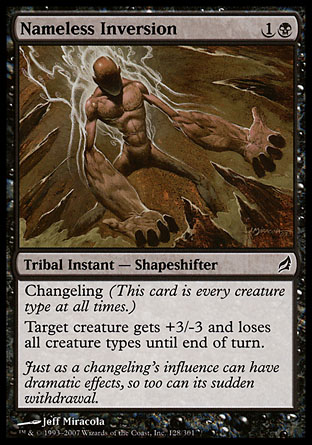

Zero
----

这是第一篇文章，我是mcfog，一个怀揣小小文艺梦想的技术宅。我的技术不是很好，技术博客有写一些，但说句大话，效果一般(-_-)。个人博客曾经有写过，但没个主题也没人关注，缺乏更新的动力。朋友圈偶尔骚一把，但篇幅受限，还混在日常吐槽之中，还没有缺乏历史积累。于是穷途末路之下突然想起还有公共帐号这么个神奇的似乎介于上述种种地方之间的地方，故而来这么尝试一把。

据说程序员当中擅长写字的不多，我也是个语文不用几乎，就是不及格的差学生。但好歹有朋友给我“文艺”的评价，于是我觉得可以花一些时间来为赋新词强说愁一把。这里的定位呢大概算是科技人文，或者说程序员人文吧。我以为在茫茫程序员之中，我还属于幸福指数比较高的一半，也希望能将我小小的幸福分享给大家，提升一下大家的幸福指数。

帐号的名字『M薇C信』，是去年还是前年的时候，随便点点的时候起的，起因大概是原来想起类似MC的微信什么之类的名字。等想把公众帐号注册起来的时候，发现名字竟是完全不让改的。

第一篇文章往往是About类型的比较好，我也已经About了好久了，那么顺着名字这个话题谈谈今天的主题吧。我一直相信“名字”这个东西是蕴含力量的。

由于肚子没什么干货，掠过各类佐证和考察，大致提纲有

+ 姓和氏，祖先崇拜，贵族身份（矮人把族谱全写在名字里很带感吧）
+ 辈份（●●●●IV世 一下子很带感吧）
+ 父母(命名者)的期许（1949年有多少个●建国出生呢）
+ 社会对你的认知（人在社会中的存在，名字是第一象征）
+ 心理暗示（以上的因素夹杂在一起，结合自己的心理暗示，最终变成为名字的力量）

或许是由于中二迟迟不能痊愈，我总是倾向于将我的名字作“避世”“隐者”解，以此来解释我社交技能的蹩脚（<del>当然本质只是现实逃避</del>）。后来在高中，又给自己起了一个ID=mcfog，由『感觉很神秘又很空虚的fog』和『加在名字前不明觉历的mc』组成，这个ID随我至今。慢慢的，我渐渐从我的名字中感受到一些力量，慢慢意识到姓名承载了我在现实社会之中的存在，ID承载了我在互联网上的存在。

所谓“有名人”的名字固然有着强大的力量，但普通人的名字同样是蕴含自己的力量的：想象一下突然有一天你改了个名字，其实这根本做不到对不对，认识你的人仍然会用原来的名字称呼你，你的新名字没有任何力量。你必须向几乎所有你认识的人，向整个社会解释你改名了，让他们用新名字称呼你，让信用卡换一张带新名字的卡片，换身份证等等。然后再经过时间的洗刷，渐渐的你的老名字的力量才会转移到新名字之中，当中一般还有损耗。同时你的老名字的力量也绝不会消失，他会待在你的“曾用名”之中，已经失去联系的旧识还以老名字来识别你，你的最亲近的父母爱人也对你的老名字有反应。

程序员十之八九有“起名障碍”，恐怕就是因为我们最清楚名字的力量，这种被称为标识符的东西，甚至直接决定了一大段代码的品味<del>、逼格</del>。人类历史上从来没有任何一种创造者会需要像程序员这样频繁的来起名字：诗人不会为自己写的每一个诗句起一个名字；画家不会为自己画作的每一部分起一个名字；建筑师不会为建筑每根柱子起一个名字；工程师也最多只是给图纸上的柱子分配一个编号……只有程序员，只有计算机程序，作为创作品，其__内部__需要如此之多的名字，以至于命名风格可以成为程序风格的重要部分，命名规范可以成为专业程序员必须协商且遵循的守则。

如果需要让一段程序不可读，很多时候只要拿掉所有的名字就够了。从这个角度上来说，可以说程序员对程序的认知是完全通过其中的名字来进行的，不遵守语法编译器会报错，但程序员照样能看懂（还能矫正），但去掉了名字，即使语法上无错可以编译运行，程序员却是再也无法理解了。名字是程序员认知一个程序元素的最重要的乃至几乎唯一的手段，所以程序员才会对起名感到畏惧：他们清楚一堆好名字甚至能让程序琅琅上口，而一个烂名字是怎样的万丈深渊，坑人于无形之间。

结论：<del>把变量叫data把方法叫call的人赶紧去死一死</del> 珍惜自己的姓名、网名、游戏名，想想名字带给你的力量，对你的影响如何。如果有机会起名字，多花点时间，多花点心思。

---

题图：塔罗牌【0 愚者】

尾图：万智 【无名倒错】

